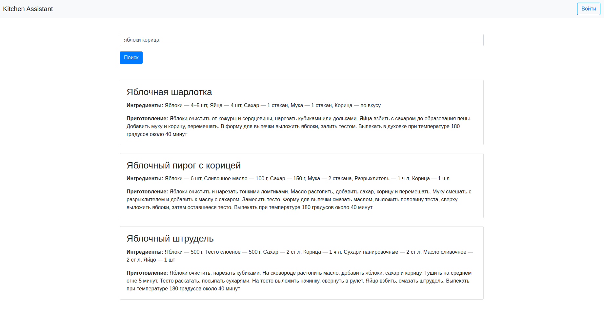

## project-kitchen-assistant

#### Написан простой фронт, пока реализован только поиск рецептов по введенным ингредиентам (метод searchRecipes() из RecipeService):
* запустить приложение 
* открыть в браузере http://localhost:8080/

#### Вопросы по проекту:
1) Как лучше хранить информацию об ингредиентах и приготовлении: список или строка, чтобы потом проще было передавать информацию в todoist или др.сервисы? (для Recipe, RecipeCreateDTO, RecipeDTO)
2) Допустим ли парсинг респонса с помощью регулярок (как реализовано сейчас) или выглядит костыльно и лучше использовать библиотеки?

