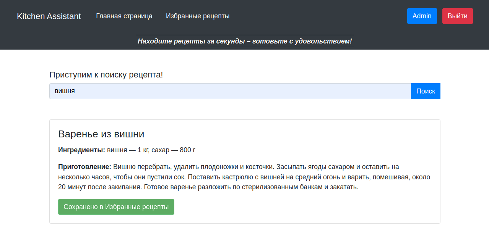
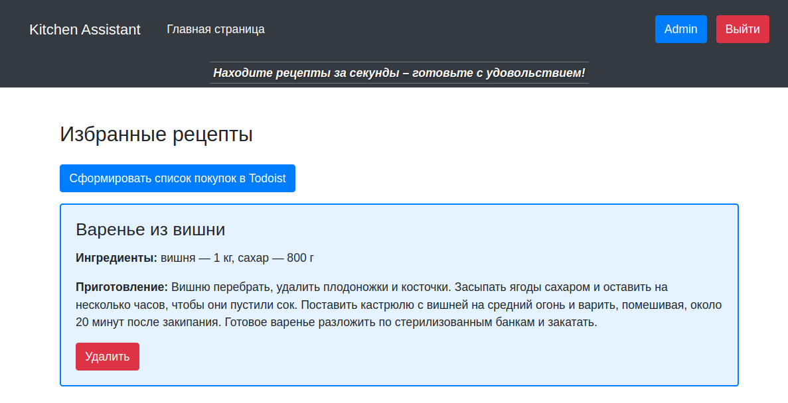
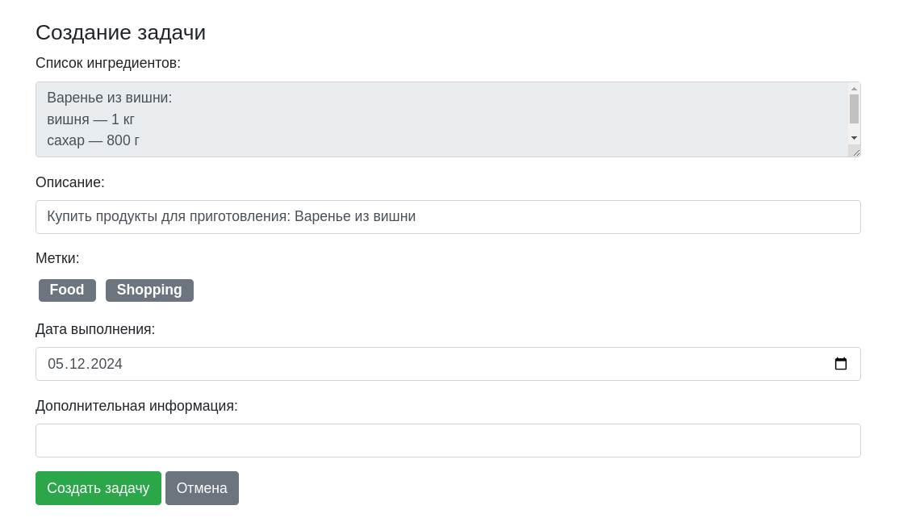
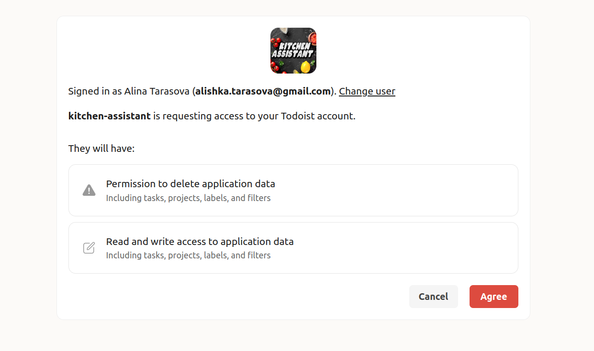
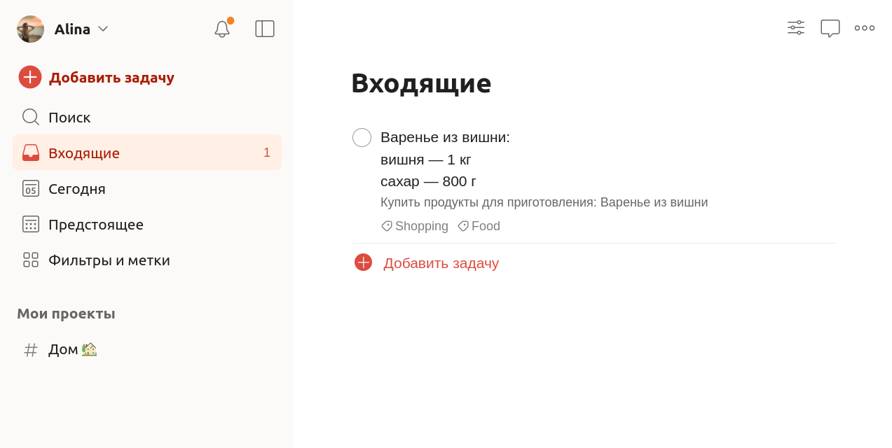

# Kitchen Assistant App


## Описание проекта

Kitchen Assistant App — это веб-приложение, разработанное на базе Spring Boot и Java, которое помогает пользователям находить рецепты на основе выбранных ингредиентов. С помощью нашего приложения вы можете легко искать вкусные блюда и сохранять понравившиеся рецепты в разделе «Избранные». Кроме того, мы интегрировали функционал для создания задач на покупку необходимых ингредиентов в сервисе Todoist, что делает процесс готовки еще более удобным и структурированным.

Demo: https://kitchen-assistant-app.onrender.com/
## Основные функции

- **Поиск рецептов по ингредиентам:** Введите один или несколько ингредиентов, и приложение предложит разнообразные рецепты, в которых они используются.



- **Избранные рецепты:** Сохраните ваши любимые рецепты для быстрого доступа в любое время.




- **Создание задач в Todoist:** Легко создавайте задачи для покупок, добавляя ингредиенты из ваших избранных рецептов в ваш список дел в Todoist.




## Технологии

- **Язык программирования:** Java <svg xmlns="http://www.w3.org/2000/svg" x="0px" y="0px" width="40" height="40" viewBox="0 0 48 48">
  <path fill="#F44336" d="M23.65,24.898c-0.998-1.609-1.722-2.943-2.725-5.455C19.229,15.2,31.24,11.366,26.37,3.999c2.111,5.089-7.577,8.235-8.477,12.473C17.07,20.37,23.645,24.898,23.65,24.898z"></path><path fill="#F44336" d="M23.878,17.27c-0.192,2.516,2.229,3.857,2.299,5.695c0.056,1.496-1.447,2.743-1.447,2.743s2.728-0.536,3.579-2.818c0.945-2.534-1.834-4.269-1.548-6.298c0.267-1.938,6.031-5.543,6.031-5.543S24.311,11.611,23.878,17.27z"></path><g><path fill="#1565C0" d="M32.084 25.055c1.754-.394 3.233.723 3.233 2.01 0 2.901-4.021 5.643-4.021 5.643s6.225-.742 6.225-5.505C37.521 24.053 34.464 23.266 32.084 25.055zM29.129 27.395c0 0 1.941-1.383 2.458-1.902-4.763 1.011-15.638 1.147-15.638.269 0-.809 3.507-1.638 3.507-1.638s-7.773-.112-7.773 2.181C11.683 28.695 21.858 28.866 29.129 27.395z"></path><path fill="#1565C0" d="M27.935,29.571c-4.509,1.499-12.814,1.02-10.354-0.993c-1.198,0-2.974,0.963-2.974,1.889c0,1.857,8.982,3.291,15.63,0.572L27.935,29.571z"></path><path fill="#1565C0" d="M18.686,32.739c-1.636,0-2.695,1.054-2.695,1.822c0,2.391,9.76,2.632,13.627,0.205l-2.458-1.632C24.271,34.404,17.014,34.579,18.686,32.739z"></path><path fill="#1565C0" d="M36.281,36.632c0-0.936-1.055-1.377-1.433-1.588c2.228,5.373-22.317,4.956-22.317,1.784c0-0.721,1.807-1.427,3.477-1.093l-1.42-0.839C11.26,34.374,9,35.837,9,37.017C9,42.52,36.281,42.255,36.281,36.632z"></path><path fill="#1565C0" d="M39,38.604c-4.146,4.095-14.659,5.587-25.231,3.057C24.341,46.164,38.95,43.628,39,38.604z"></path></g>
  </svg>
- **Фреймворк:** Spring Boot <svg xmlns="http://www.w3.org/2000/svg" x="0px" y="0px" width="30" height="30" viewBox="0 0 48 48">
  <path fill="#8bc34a" d="M43.982,23.635c0.069-4.261-0.891-9.328-2.891-15.273l-1.568-4.662l-2.13,4.433 c-0.114,0.237-0.244,0.469-0.38,0.698C33.514,5.827,28.974,4,24,4C12.954,4,4,12.954,4,24c0,11.046,8.954,20,20,20s20-8.954,20-20 C44,23.877,43.984,23.758,43.982,23.635z"></path><path fill="#fff" d="M39.385 32.558c-3.123 4.302-8.651 4.533-13.854 4.442H18.75h-1.938c4.428-1.593 7.063-1.972 9.754-3.4 5.068-2.665 10.078-8.496 11.121-14.562-1.93 5.836-7.779 10.85-13.109 12.889-3.652 1.393-10.248 2.745-10.248 2.745l-.267-.145C9.573 32.268 9.437 22.214 17.6 18.968c3.574-1.423 6.993-.641 10.854-1.593 4.122-1.012 8.89-4.208 10.83-8.375C41.456 15.667 44.07 26.106 39.385 32.558L39.385 32.558zM15.668 38.445C15.386 38.795 14.955 39 14.505 39c-.823 0-1.495-.677-1.495-1.5s.677-1.5 1.495-1.5c.341 0 .677.118.941.336C16.086 36.855 16.186 37.805 15.668 38.445L15.668 38.445z"></path>
  </svg>
- **База данных:** PostgreSQL <svg xmlns="http://www.w3.org/2000/svg" x="0px" y="0px" width="33" height="30" viewBox="0 0 48 48">
  <path fill="#fff" d="M44.083,29.79c-0.183-0.829-0.935-1.796-2.452-1.796c-0.31,0-0.649,0.039-1.035,0.119c-0.708,0.146-1.311,0.217-1.842,0.241c4.133-7.04,6.816-16.819,4.159-20.214c-3.501-4.473-8.214-5.141-10.711-5.141L31.967,3c-0.929,0.015-1.893,0.129-2.863,0.339l-3.583,0.774C25.033,4.052,24.536,4.009,24.018,4l-0.03,0l-0.016,0l-0.152-0.001c-1.593,0-3.046,0.338-4.341,0.973l-1.251-0.493c-1.72-0.678-4.308-1.485-6.868-1.485c-0.144,0-0.287,0.003-0.431,0.008C8.407,3.093,6.241,4.05,4.664,5.769C2.696,7.915,1.8,11.054,2.003,15.1C2.013,15.309,4.461,36,11.4,36h0.025l0.064-0.001c0.901-0.022,1.76-0.384,2.563-1.077c0.613,0.46,1.406,0.732,2.145,0.84c0.488,0.115,1.366,0.278,2.418,0.278c1.284,0,2.442-0.263,3.44-0.738c-0.001,0.88-0.006,1.994-0.016,3.418l-0.001,0.075l0.005,0.075c0.097,1.419,0.342,2.698,0.711,3.701c1.051,2.859,2.866,4.434,5.111,4.434c0.093,0,0.188-0.003,0.284-0.009c1.846-0.114,3.717-1.151,5.004-2.772c1.393-1.755,1.715-3.607,1.839-5.026L35,39.111v-0.088v-4.079l0.103,0.01l0.436,0.038l0.042,0.004l0.042,0.002c0.124,0.006,0.252,0.008,0.381,0.008c1.507,0,3.362-0.391,4.616-0.974C41.819,33.476,44.559,31.948,44.083,29.79z"></path><path fill="#0277bd" d="M33,34c0-0.205,0.012-0.376,0.018-0.565C33.008,33.184,33,33,33,33s0.012-0.009,0.032-0.022c0.149-2.673,0.886-3.703,1.675-4.29c-0.11-0.153-0.237-0.318-0.356-0.475c-0.333-0.437-0.748-0.979-1.192-1.674l-0.082-0.158c-0.067-0.164-0.229-0.447-0.435-0.819c-1.183-2.14-3.645-6.592-1.96-9.404c0.738-1.232,2.122-1.942,4.121-2.117C33.986,11.718,30.925,6.115,23.985,6c-0.002,0-0.004,0-0.006,0c-6.041-0.098-8.026,5.392-8.672,8.672c0.89-0.377,1.906-0.606,2.836-0.606c0.014,0,0.029,0,0.043,0c2.29,0.017,3.865,1.239,4.323,3.354c0.335,1.552,0.496,2.91,0.492,4.153c-0.01,2.719-0.558,4.149-1.042,5.411l-0.154,0.408c-0.124,0.334-0.255,0.645-0.379,0.937c-0.126,0.298-0.237,0.563-0.318,0.802c0.484,0.11,0.864,0.265,1.125,0.38l0.151,0.066c0.047,0.02,0.094,0.043,0.137,0.069c0.848,0.516,1.376,1.309,1.489,2.233c0.061,0.498,0.051,3.893,0.03,6.855c0.087,1.285,0.305,2.364,0.593,3.146c0.409,1.114,1.431,3.241,3.394,3.119c1.37-0.085,2.687-0.919,3.561-2.019c0.938-1.181,1.284-2.487,1.414-3.958V34z"></path><path fill="#0277bd" d="M15.114 28.917c-1.613-1.683-2.399-3.947-2.104-6.056.285-2.035.124-4.027.037-5.098-.029-.357-.048-.623-.047-.77 0-.008.002-.015.003-.023 0-.004-.002-.007-.002-.011.121-3.021 1.286-7.787 4.493-10.62C15.932 5.724 13.388 4.913 11 5 7.258 5.136 3.636 7.724 4 15c.137 2.73 3.222 19.103 7.44 19 .603-.015 1.229-.402 1.872-1.176 1.017-1.223 2.005-2.332 2.708-3.104C15.705 29.481 15.401 29.217 15.114 28.917zM37.023 14.731c.015.154.002.286-.022.408.031.92-.068 1.813-.169 2.677-.074.636-.15 1.293-.171 1.952-.021.645.07 1.282.166 1.956.225 1.578.459 3.359-.765 5.437.225.296.423.571.581.837 4.61-7.475 6.468-16.361 4.695-18.626C38.655 5.944 34.941 4.952 31.999 5c-.921.015-1.758.139-2.473.294C34.602 7.754 36.863 13.026 37.023 14.731zM41 30.071c-2.665.55-3.947.257-4.569-.126-.1.072-.2.133-.293.19-.372.225-.961.583-1.105 2.782.083.016.156.025.246.044L35.714 33c1.32.06 3.049-.31 4.063-.781C41.962 31.205 43.153 29.627 41 30.071zM22.023 32.119c-.037-.298-.198-.539-.492-.732l-.108-.047C21.062 31.181 20.653 31 20 31h-.004c-.127.01-.253.019-.38.019-.052 0-.103-.007-.155-.009-.474.365-1.148.647-2.816.99-2.98.759-1.221 1.655-.078 1.794 1.106.277 3.735.614 5.481-.809C22.043 32.537 22.035 32.229 22.023 32.119z"></path><path fill="#0277bd" d="M20.681 18.501c-.292.302-.753.566-1.262.484-.828-.134-1.463-1.133-1.417-1.508h0c.044-.374.751-.569 1.578-.435.287.047.548.128.768.228-.32-.688-.899-1.085-1.782-1.182-1.565-.174-3.226.644-3.56 1.097.007.11.02.251.033.417.093 1.147.265 3.284-.05 5.537-.208 1.485.393 3.169 1.567 4.395.757.79 1.641 1.29 2.513 1.438.111-.478.309-.944.513-1.425.113-.265.233-.547.346-.852l.162-.427c.443-1.155.9-2.35.909-4.703C21.003 20.66 20.892 19.627 20.681 18.501zM34.847 22.007c-.104-.729-.211-1.484-.185-2.303.023-.742.105-1.442.184-2.119.062-.533.11-1.045.138-1.55-1.289.107-2.145.479-2.551 1.108.168-.057.358-.102.568-.129.892-.116 1.543.141 1.618.637.055.363-.253.705-.388.836-.277.269-.626.442-.981.488-.064.008-.129.012-.192.012-.353 0-.69-.121-.949-.3.112 1.973 1.567 4.612 2.283 5.907.153.277.271.498.369.688C35.154 24.163 35.009 23.143 34.847 22.007z"></path>
  </svg> 
- **Front-end:**  HTML5 <svg xmlns="http://www.w3.org/2000/svg" x="0px" y="0px" width="30" height="30" viewBox="0 0 48 48">
  <path fill="#E65100" d="M41,5H7l3,34l14,4l14-4L41,5L41,5z"></path><path fill="#FF6D00" d="M24 8L24 39.9 35.2 36.7 37.7 8z"></path><path fill="#FFF" d="M24,25v-4h8.6l-0.7,11.5L24,35.1v-4.2l4.1-1.4l0.3-4.5H24z M32.9,17l0.3-4H24v4H32.9z"></path><path fill="#EEE" d="M24,30.9v4.2l-7.9-2.6L15.7,27h4l0.2,2.5L24,30.9z M19.1,17H24v-4h-9.1l0.7,12H24v-4h-4.6L19.1,17z"></path>
  </svg>, CSS <svg xmlns="http://www.w3.org/2000/svg" x="0px" y="0px" width="30" height="30" viewBox="0 0 48 48">
  <path fill="#0277BD" d="M41,5H7l3,34l14,4l14-4L41,5L41,5z"></path><path fill="#039BE5" d="M24 8L24 39.9 35.2 36.7 37.7 8z"></path><path fill="#FFF" d="M33.1 13L24 13 24 17 28.9 17 28.6 21 24 21 24 25 28.4 25 28.1 29.5 24 30.9 24 35.1 31.9 32.5 32.6 21 32.6 21z"></path><path fill="#EEE" d="M24,13v4h-8.9l-0.3-4H24z M19.4,21l0.2,4H24v-4H19.4z M19.8,27h-4l0.3,5.5l7.9,2.6v-4.2l-4.1-1.4L19.8,27z"></path>
  </svg>, JS <svg xmlns="http://www.w3.org/2000/svg" x="0px" y="0px" width="30" height="30" viewBox="0 0 48 48">
  <path fill="#ffd600" d="M6,42V6h36v36H6z"></path><path fill="#000001" d="M29.538 32.947c.692 1.124 1.444 2.201 3.037 2.201 1.338 0 2.04-.665 2.04-1.585 0-1.101-.726-1.492-2.198-2.133l-.807-.344c-2.329-.988-3.878-2.226-3.878-4.841 0-2.41 1.845-4.244 4.728-4.244 2.053 0 3.528.711 4.592 2.573l-2.514 1.607c-.553-.988-1.151-1.377-2.078-1.377-.946 0-1.545.597-1.545 1.377 0 .964.6 1.354 1.985 1.951l.807.344C36.452 29.645 38 30.839 38 33.523 38 36.415 35.716 38 32.65 38c-2.999 0-4.702-1.505-5.65-3.368L29.538 32.947zM17.952 33.029c.506.906 1.275 1.603 2.381 1.603 1.058 0 1.667-.418 1.667-2.043V22h3.333v11.101c0 3.367-1.953 4.899-4.805 4.899-2.577 0-4.437-1.746-5.195-3.368L17.952 33.029z"></path>
  </svg>, Bootstrap <svg xmlns="http://www.w3.org/2000/svg" x="0px" y="0px" width="30" height="30" viewBox="0 0 48 48">
  <path fill="#673ab7" d="M42,37c0,2.762-2.238,5-5,5H11c-2.761,0-5-2.238-5-5V11c0-2.762,2.239-5,5-5h26c2.762,0,5,2.238,5,5 V37z"></path><path fill="#fff" d="M33.03,25.6c-0.65-0.9-1.59-1.52-2.8-1.85c0,0,1.02-0.37,1.94-1.75c0.55-0.88,0.83-1.94,0.83-3.18 c0-2.15-0.78-3.8-2.34-4.93C29.1,12.76,27.34,12,24.35,12H15v24h10.43c2.83-0.02,4.96-0.63,6.41-1.8c1.44-1.19,2.16-2.95,2.16-5.3 C34,27.6,33.68,26.5,33.03,25.6z M21,16c0,0,4.17,0,4.25,0c1.52,0,2.75,1.23,2.75,2.75c0,1.52-1.23,2.75-2.75,2.75 c-0.08,0-4.25,0-4.25,0V16z M26,32h-5v-6h5c1.66,0,3,1.34,3,3C29,30.66,27.66,32,26,32z"></path>
  </svg>

- **Интеграция с YandexGPT API:** Для получения оригинальных рецептов на основе введённых ингредиентов.
- **Интеграция с Todoist API**

## Установка и запуск

1. Клонируйте репозиторий:
   ```bash
   git clone git@github.com:funnyDevGirl/project-kitchen-assistant.git
    ```
2. Перейдите в директорию проекта:
   ```bash
    cd project-kitchen-assistant
    ```
3. Настройте базу данных (если необходимо).
4. Запустите приложение:
   ```bash
   make run
   ```
5. Откройте браузер и перейдите по адресу: http://localhost:8080

## Тестовые учетные данные

Для тестирования приложения вы можете использовать следующие учетные данные:

- **Логин:** email@example.com
- **Пароль:** qwerty

Эти данные позволят вам войти в приложение и ознакомиться с его функциональностью без необходимости создавать собственный аккаунт.

