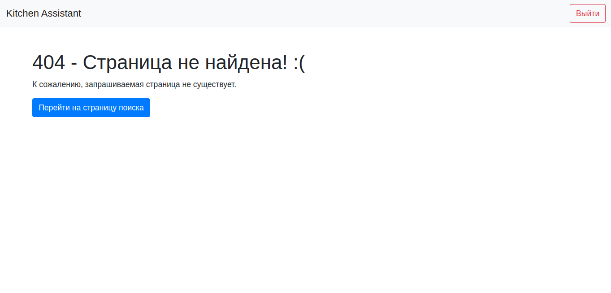

## project-kitchen-assistant

#### Back-end на данном этапе:
* регистрация / аутентификация
* поиск рецептов по ингредиентам

#### Протестировать в браузере:
* запустить приложение 
* открыть в браузере http://localhost:8080/

#### Тестовые данные для входа в сервис:
* login: email@example.com
* password: qwerty

#### Front-end на данном этапе:

